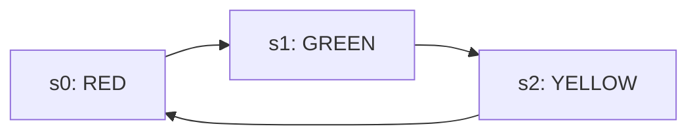

# 3-State Traffic Light Controller FSM (Verilog)

A classic Finite State Machine (FSM) implementation of a Traffic Light Controller (Red ➡️ Green ➡️ Yellow) written in synthesizable Verilog. This project showcases structured FSM separation using a 2-process architectural model.

## 📐 FSM Architecture & State Flow

The controller uses a cyclic state sequence to manage traffic transitions safely:
* **State 0 (`s0`):** Red Light active. Next transition leads to Green.
* **State 1 (`s1`):** Green Light active. Next transition leads to Yellow.
* **State 2 (`s2`):** Yellow Light active. Loop sequence cycles back to Red.



### 🧠 Design Methodology
This design splits sequential and combinational logic into separate execution domains for optimal optimization during hardware synthesis:
1. **Sequential Logic Block:** Handles state changes on the rising edge (`posedge`) of the clock. Includes a `default` tracking clause to prevent state machine deadlocks from uninitialized hardware vectors.
2. **Combinational Output Block:** Decodes the active state to assert the correct output bus pattern (`light[2:0]`) using clean parallel routing vectors.

---

## 📊 Behavioral Simulation Waveform

The timing behavior is verified using behavioral test benches, outputting value transitions cleanly into a VCD (Value Change Dump) file format.

Below is the verification trace captured via GTKWave:


### Waveform Analysis Metrics:
* **0ns – 5ns:** The initialization phase where vectors align.
* **5ns – 15ns:** `state` shifts to `01` (`s1`), asserting the Green light (`010`).
* **15ns – 25ns:** `state` shifts to `10` (`s2`), asserting the Yellow light (`100`).
* **25ns – 35ns:** `state` cycles to `00` (`s0`), asserting the Red light (`000`).

---

## 🛠️ Verification Setup

### Prerequisites
Compile and run the verification setup natively using Icarus Verilog (`iverilog`) or any standard vendor tools (Vivado XSIM, ModelSim).

### Execution Commands (iVerilog)
```bash
# Compile design files and testbench
iverilog -o rgy_sim rtl/rgy.v tb/rgyt.v

# Run simulation to dump VCD wave data
vvp rgy_sim

# View waveform traces
gtkwave rgy.vcd
```
